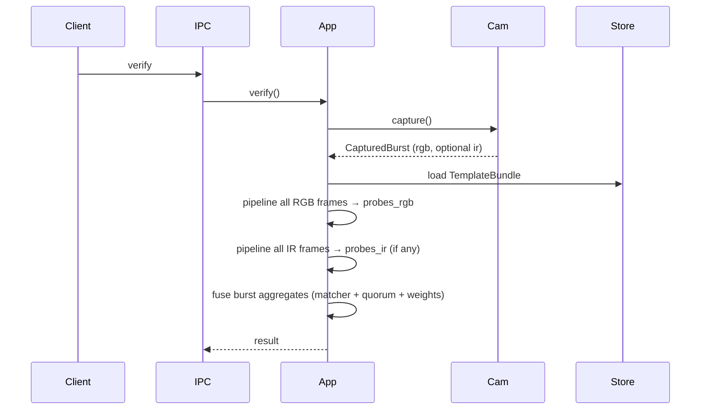

# Architecture

## Overview

Crates split **core** (ports + `TrueIdApp`) from **adapters** (camera, ONNX, files).

On **verify**:

1. **CameraCapture** — one logical burst (RGB + optional IR in parallel at the adapter).
2. **RGB path** — run detect → align → liveness → embed on **every RGB frame** → `Vec<Option<Embedding>>`.
3. **IR path** (if present) — same pipeline on **every IR frame**, independently → `Vec<Option<Embedding>>`.
4. **Fusion** — summarize each stream across the burst: **any frame** may satisfy template quorum for that modality; best-template similarity is the **max** over frames with embeddings. When both RGB and IR templates exist and both streams produced embeddings: **accept immediately** if both modalities hit quorum on some frame; otherwise compare `weight_rgb * sim_rgb + weight_ir * sim_ir` to the fusion threshold using those real max similarities (quorum is not mapped to a perfect 1.0 score). RGB-only / IR-only paths still use quorum alone for that side. RGB and IR are **not** paired by frame index.
5. Accept if the fused burst decision passes.

---

## Components

* **TrueIdApp** — auth pipeline (`ping`, `enroll`, `verify`, `add_template`)
* **Health** — readiness gate before capture
* **CameraCapture** — `capture(CaptureSpec)` → **`CapturedBurst`** (`rgb` frames, optional `ir`)
* **VideoSource** — single stream; used only inside camera adapters (V4L, mock)
* **FaceDetector** — primary face → `FaceDetection`
* **FaceAligner** — crop/warp to a standard face image
* **LivenessChecker** — spoof check on aligned crop
* **FaceEmbedder** — face image → embedding
* **EmbeddingMatcher** — compare embeddings (e.g. cosine vs threshold)
* **TemplateStore** — persist **`TemplateBundle`** (`rgb` and `ir` template lists, matched separately at verify)

Concrete behavior lives in adapters (V4L, mocks, ONNX, disk). **Config** (`config.yaml`) is read only in the daemon, not in core.

---

## Capture model

* One **`CameraCapture::capture`** call = one logical burst from the app’s perspective
* Under the hood: RGB-only adapter runs one `VideoSource::capture`; parallel RGB+IR runs two captures on separate threads (best-effort overlap, not hardware-synced)
* Warm-up frames optional (dropped), then N frames; no continuous streaming API

---

## Flow

