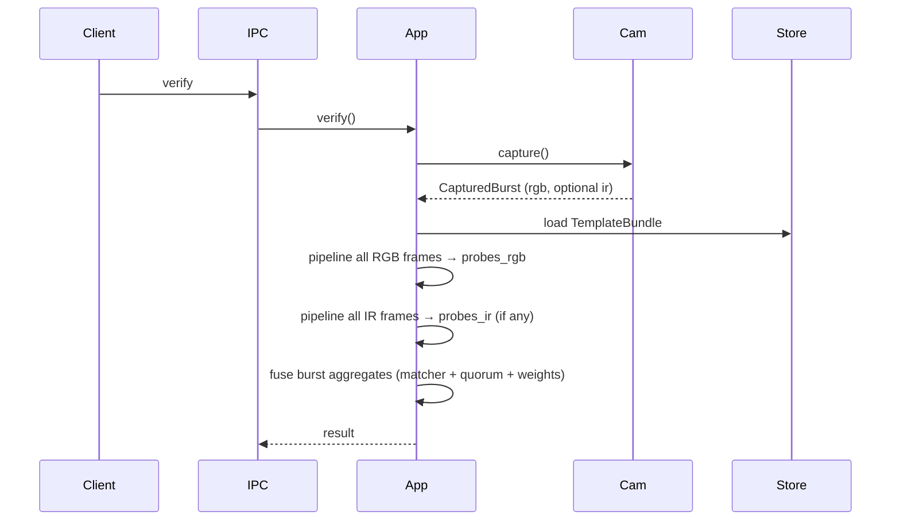

# Architecture

## Overview

Crates split **core** (ports + `TrueIdApp`) from **adapters** (camera, ONNX, files).

On **verify**:

1. **CameraCapture** — one burst (RGB + optional IR).
2. **RGB** — detect → align → liveness → embed per frame → `Vec<Option<Embedding>>`.
3. **IR** (if present) — same per IR frame.
4. **Fusion** — per modality: max template similarity over the burst; quorum if any frame passes. RGB/IR not paired by index. Dual enroll: both quorums, or `weight_rgb * sim_r + weight_ir * sim_i >= threshold` on clamped sims; single enroll: quorum on that list.
5. Accept if step 4 passes.

---

## Components

* **TrueIdApp** — auth pipeline (`ping`, `enroll`, `verify`, `add_template`)
* **Health** — readiness gate before capture
* **CameraCapture** — `capture(CaptureSpec)` → **`CapturedBurst`** (`rgb` frames, optional `ir`)
* **VideoSource** — single stream; used only inside camera adapters (V4L, mock)
* **FaceDetector** — primary face → `FaceDetection`
* **FaceAligner** — crop/warp to a standard face image
* **LivenessChecker** — spoof check on aligned crop
* **FaceEmbedder** — face image → embedding
* **EmbeddingMatcher** — compare embeddings (e.g. cosine vs threshold)
* **TemplateStore** — `TemplateBundle` (`rgb` / `ir` lists)

Adapters implement V4L, mocks, ONNX, disk. The daemon reads `config.yaml`; core does not.

---

## Capture model

* One `CameraCapture::capture` = one burst.
* RGB-only: one `VideoSource::capture`. RGB+IR: two threads, best-effort overlap (not frame-synced).
* Optional warm-up discard, then N frames; no streaming API.

---

## Flow

