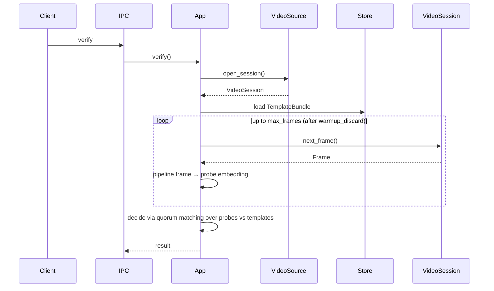

# Architecture

## Overview

Crates split **core** (ports + `TrueIdApp`) from **adapters** (camera, ONNX, files).

On **verify**:

1. **VideoSource** — open a streaming session (`open_session`) on the configured modality (RGB **or** IR).
2. **Stream** — pull frames with `next_frame()` until capture limits are reached (warmup discard + max frames).
3. **Pipeline** — detect → align → liveness → embed per frame → probe embeddings.
4. **Match** — compare probe embeddings against stored templates (quorum-style decision over the stream).
5. Return result.

---

## Components

* **TrueIdApp** — auth pipeline (`ping`, `enroll`, `verify`, `add_template`)
* **Health** — readiness gate before capture
* **VideoSource** — open a streaming session; used inside camera adapters (V4L, mock)
* **VideoSession** — `next_frame()` iterator-like interface
* **FaceDetector** — primary face → `FaceDetection`
* **FaceAligner** — crop/warp to a standard face image
* **LivenessChecker** — spoof check on aligned crop
* **FaceEmbedder** — face image → embedding
* **EmbeddingMatcher** — compare embeddings (e.g. cosine vs threshold)
* **TemplateStore** — templates as a single list of embeddings per user (`TemplateBundle.templates`)

Adapters implement V4L, mocks, ONNX, disk. The daemon reads `config.yaml`; core does not.

---

## Capture model

* One operation (`enroll` / `verify` / `add_template`) opens one `VideoSource` streaming session.
* Exactly one modality per deployment: RGB **or** IR (no fusion).
* Optional warm-up discard, then at most `max_frames` frames are pulled from the session.

---

## Flow

