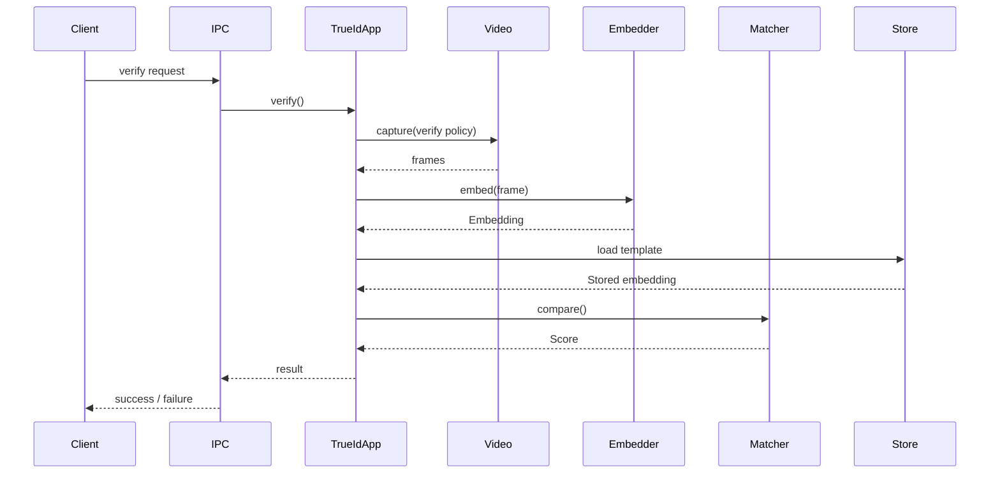

# Architecture

## Overview

I’m building TrueID as a Howdy-style face unlock for Linux: enough structure to swap camera,
storage, and models without rewriting the middle. This doc is how the crates are laid out.

`TrueIdApp` runs the pipeline:

1. Capture frames from the camera (one session: optional warm-up discards, then N kept frames)
2. Convert it into an embedding
3. Compare it against stored templates
4. Return an authentication decision

Core stays free of V4L paths, embedder weights, and JSON paths—those live in adapters.

---

## High-Level Structure

```mermaid
flowchart TD
    IPC[IPC Layer (Unix Socket)]
    App[TrueIdApp]

    subgraph Ports
        Video[VideoSource]
        Embedder[Embedder]
        Matcher[Matcher]
        Store[TemplateStore]
        Health[Health]
    end

    subgraph Adapters
        V4L[V4lVideoSource]
        MockVideo[MockVideoSource]
        Cosine[CosineMatcher]
        FileStore[FileTemplateStore]
        MockEmbedder[MockEmbedder]
    end

    IPC --> App

    App --> Video
    App --> Embedder
    App --> Matcher
    App --> Store
    App --> Health

    Video --> V4L
    Video --> MockVideo
    Matcher --> Cosine
    Store --> FileStore
    Embedder --> MockEmbedder
```

---

## Components

### `TrueIdApp`

The central application service responsible for coordinating authentication and enrollment.

It does not depend on concrete implementations. Instead, it operates on abstract interfaces
(ports), allowing the underlying components to be swapped without changing core logic.

---

### Ports (Core Interfaces)

Ports define the boundaries of the system. They represent capabilities the application needs,
without specifying how they are implemented.

Examples include:

* `VideoSource` — `capture(CaptureSpec)` returns frames from one camera session
* `Embedder` — converts frames into embeddings
* `Matcher` — compares embeddings against stored templates
* `TemplateStore` — persists and retrieves enrolled templates
* `Health` — exposes system health status

---

### Adapters (Implementations)

Adapters provide concrete implementations of the ports.

Examples:

* `V4lVideoSource` — captures frames using V4L2
* `MockVideoSource` — provides synthetic frames for testing
* `FileTemplateStore` — stores templates on disk
* `CosineMatcher` — compares embeddings using cosine similarity
* `MockEmbedder` — placeholder embedder for development

Adapters can be replaced without affecting the rest of the system.

---

### IPC Layer

The IPC layer exposes the application over a Unix domain socket.

It is responsible for:

* receiving requests (e.g. enroll, verify)
* invoking the appropriate application logic
* returning responses

This layer is intentionally thin and delegates all business logic to `TrueIdApp`.

---

## Design Principles

### Separation of Concerns

Core logic is isolated from:

* hardware (camera)
* storage
* machine learning models
* operating system interfaces

This makes the system easier to test and evolve.

---

### Dependency Injection

All dependencies are provided at startup and passed into `TrueIdApp`.

This allows:

* swapping implementations (e.g. mock vs real camera)
* easier testing
* no reliance on global state

---

### One-Shot Capture Model

The video pipeline is designed for **on-demand capture**, not continuous streaming.

Each frame acquisition may:

* start the camera stream
* capture a single frame
* stop the stream

This matches biometric authentication workflows:

* the camera is only active during enrollment or verification
* avoids unnecessary resource usage
* ensures predictable device behavior

---

### Format Normalization

All video input is normalized to:

* `RGB8` pixel format
* consistent width/height per session

This ensures downstream components (embedding, matching) do not need to handle
device-specific formats such as MJPEG or YUYV.

---

## Typical Authentication Flow



---

## Notes

* The system supports both real and mock components for development and testing.
* Camera selection and configuration are controlled via environment variables.
* The architecture allows future extensions such as:

  * multi-frame capture via `CaptureSpec` (warm-up + frame count)
  * liveness detection
  * alternative embedding models
  * different storage backends

---

## Summary

Ports in `trueid-core`, adapters in `trueidd`, IPC in `trueid-ipc`. Swap pieces at startup;
no globals.
