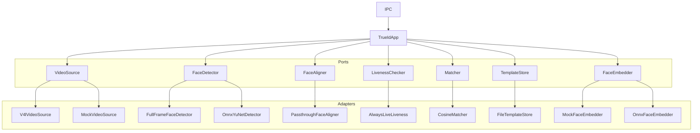
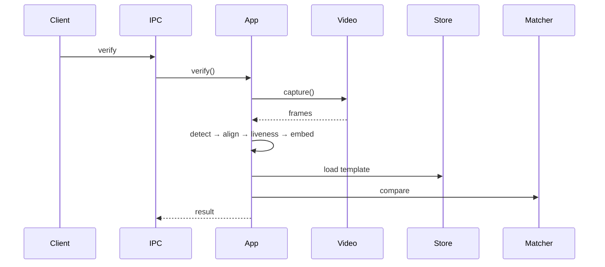

# Architecture

## Overview

Crates split **core** (ports + `TrueIdApp`) from **adapters** (camera, ONNX, files).

Per captured frame, before matching:

1. Capture (one session: optional warm-up, then N frames)
2. Detect face → align → liveness → embed
3. Compare to stored template
4. Return accept/reject

---

## Structure

---

## Components

* **TrueIdApp** — auth pipeline
* **VideoSource** — `capture(CaptureSpec)` → frames
* **FaceDetector** — primary face → `FaceDetection`
* **FaceAligner** — crop/warp to a standard face image
* **LivenessChecker** — spoof check on aligned crop
* **FaceEmbedder** — face image → embedding
* **Matcher** — compare embeddings
* **TemplateStore** — persist templates

Concrete behavior lives in adapters (V4L, mocks, ONNX, disk).

---

## Capture model

* One `capture` call = one camera session
* Warm-up frames optional (dropped)
* Then N frames returned; no continuous streaming

---

## Flow

