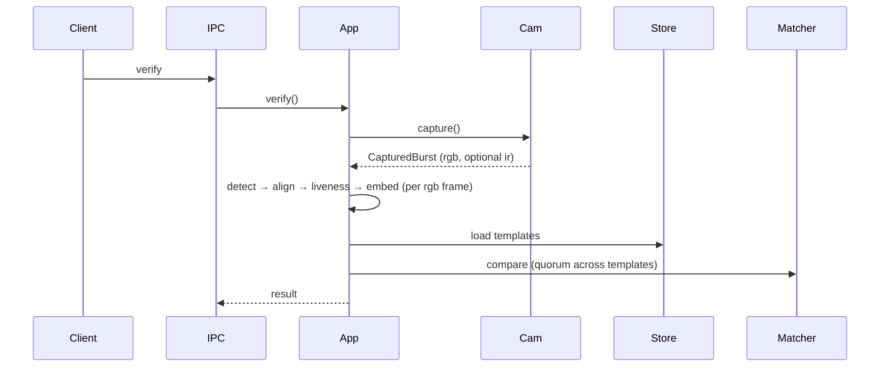

# Architecture

## Overview

Crates split **core** (ports + `TrueIdApp`) from **adapters** (camera, ONNX, files).

Per captured RGB frame, before matching:

1. **CameraCapture** — one logical burst (optional warm-up, then N frames); may run RGB only or RGB + IR in parallel (implementation detail in the daemon).
2. Detect face → align → liveness → embed
3. Compare probe to stored template(s); verify uses a **quorum** (≥ half of templates must match a probe on a frame)
4. Return accept/reject

---

## Components

* **TrueIdApp** — auth pipeline (`ping`, `enroll`, `verify`, `add_template`)
* **Health** — readiness gate before capture
* **CameraCapture** — `capture(CaptureSpec)` → **`CapturedBurst`** (`rgb` frames, optional `ir`)
* **VideoSource** — single stream; used only inside camera adapters (V4L, mock)
* **FaceDetector** — primary face → `FaceDetection`
* **FaceAligner** — crop/warp to a standard face image
* **LivenessChecker** — spoof check on aligned crop
* **FaceEmbedder** — face image → embedding
* **EmbeddingMatcher** — compare embeddings (e.g. cosine vs threshold)
* **TemplateStore** — persist templates (multiple per user supported)

Concrete behavior lives in adapters (V4L, mocks, ONNX, disk). **Config** (`config.yaml`) is read only in the daemon, not in core.

---

## Capture model

* One **`CameraCapture::capture`** call = one logical burst from the app’s perspective
* Under the hood: RGB-only adapter runs one `VideoSource::capture`; parallel RGB+IR runs two captures on separate threads (best-effort overlap, not hardware-synced)
* Warm-up frames optional (dropped), then N frames; no continuous streaming API

---

## Flow

IR frames are captured when configured but are not yet consumed by the core pipeline (reserved for future use).
