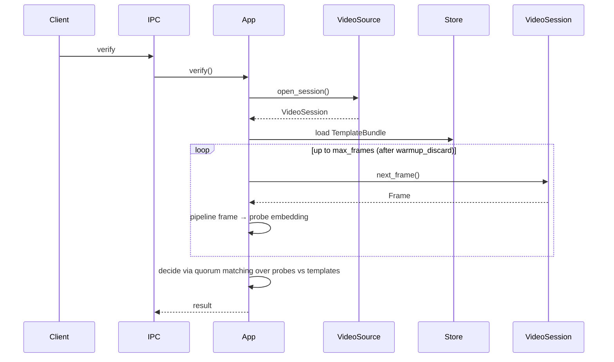

# Architecture

Hexagonal (ports and adapters). The folder tree is the pattern.

```
crates/
  trueid-core/src/                 hexagon interior
    domain/                        users, frames, faces, embeddings
    application/                   enroll, verify, add_template (inbound port)
    ports/                         outbound traits (camera, detect, store, …)

  trueid-daemon/src/
    main.rs                        load config, build app, serve IPC
    composition.rs                 wires outbound adapters → TrueIdApp
    config.rs                      YAML (core does not read this)
    adapters/
      inbound/ipc.rs               Unix socket → TrueIdApp
      outbound/<port>/             impls of core ports (V4L, ONNX, disk, …)

  trueid-ctl/                      inbound adapter (CLI)
  trueid-pam/                      inbound adapter (PAM)
  trueid-ipc/                      JSON-lines protocol used by inbound adapters
```

Driving adapters call `TrueIdApp` methods. They never construct V4L or ONNX types. Outbound adapters implement `trueid_core::ports`. Core has no camera, ONNX, filesystem, or YAML dependencies.

## Where to add something

| I want to… | Go here |
| --- | --- |
| Change match / enroll / verify rules | `trueid-core/src/application/` |
| Add a domain type | `trueid-core/src/domain/` |
| Add a capability the app needs from the outside | new trait in `trueid-core/src/ports/` **and** an impl under `trueid-daemon/src/adapters/outbound/` |
| Swap YuNet, V4L, disk, matcher | `trueid-daemon/src/adapters/outbound/<port>/` |
| Change the Unix protocol | `trueid-ipc` **and** `trueid-daemon/src/adapters/inbound/ipc.rs` |
| Change CLI or PAM | `trueid-ctl` / `trueid-pam` |
| Wire a different impl | `trueid-daemon/src/composition.rs` |
| Change config keys | `trueid-daemon/src/config.rs` + `config/config.yaml` |

## Verify flow

1. **VideoSource** — open a streaming session (`open_session`) on the configured modality (RGB **or** IR).
2. **Stream** — pull frames with `next_frame()` until capture limits are reached (warmup discard + max frames).
3. **Pipeline** — detect → align → liveness → embed per frame → probe embeddings.
4. **Match** — compare probe embeddings against stored templates (quorum-style decision over the stream).
5. Return result.

One operation (`enroll` / `verify` / `add_template`) opens one session. Exactly one modality per deployment: RGB **or** IR (no fusion).


```mermaid
sequenceDiagram
    Client->>IPC: verify
    IPC->>App: verify()

    App->>VideoSource: open_session()
    VideoSource-->>App: VideoSession

    App->>Store: load TemplateBundle
    loop up to max_frames (after warmup_discard)
        App->>VideoSession: next_frame()
        VideoSession-->>App: Frame
        App->>App: pipeline frame → probe embedding
    end
    App->>App: decide via quorum matching over probes vs templates
    App-->>IPC: result
```
